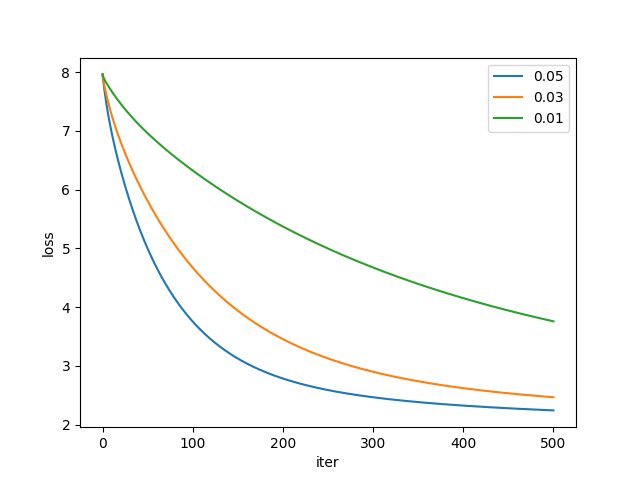

# 说明文档

**2.2.1** 
$$
J(\theta)=\frac{1}{m}(y-X\theta)^T(y-X\theta)
$$
**2.2.2**
$$
\frac{\partial J(\theta)}{\partial \theta}=\frac{2}{m}X^T\left(X\theta-y\right)
$$
**2.2.3** 设当前梯度为 $g=\nabla _\theta J(\theta)$ ，则
$$
J(\theta+\eta h)-J(\theta)\approx \eta h^Tg
$$
**2.2.4** 
$$
\theta^{t+1}\leftarrow \theta^{t} - \frac{2\eta}{m} X^T\left(X\theta-y\right)
$$

**2.2.9** 学习率大于 0.05 时损失函数发散，实验中在学习率为 0.05、0.03、0.01 时损失函数值随训练时间变化如下图：

**2.3.1**
$$
\frac{\partial J(\theta)}{\partial \theta}=\frac{2}{m}X^T\left(X\theta-y\right)+2\lambda \theta
$$
**2.3.4** 经过 500 轮训练，最终的验证集 Loss 值为：

| $\lambda$ \ 步长 |  0.05  |  0.03  |  0.01  |
| :--------------: | :----: | :----: | :----: |
|    $100    $     |  发散  |  发散  |  发散  |
|    $10     $     | 3.2813 | 4.9106 | 4.9106 |
|    $1      $     | 2.3561 | 4.4245 | 4.4245 |
|    $10^{-1}$     | 2.9586 | 2.9676 | 3.2113 |
|    $10^{-3}$     | 2.6408 | 2.5108 | 2.7847 |
|    $10^{-5}$     | 2.6660 | 2.5194 | 2.7805 |
|    $10^{-7}$     | 2.6662 | 2.5195 | 2.7805 |

**2.4.1**
$$
f_i(\theta)=\left(h_\theta(x_i)-y_i\right)^2+\frac{\lambda}{m}\theta^T\theta
$$
**2.4.2** 已知 $J(\theta)=\frac{1}{m}\sum_{i=1}^m f_i(\theta)$ ，故：
$$
\begin{align*}
\mathbb{E}\left[\nabla f_i(\theta)\right]&=\frac{1}{m}\sum_{i=1}^{m}\nabla f_i(\theta)
\\
&=\nabla \left(\frac{1}{m}\sum_{i=1}^{m} f_i(\theta)\right)
\\
&=\nabla J(\theta)
\end{align*}
$$
**2.4.4** 当 batch_size 为 4、16、64、128、256 时的训练曲线如下图：（由于 batch_size 数值小的情况下曲线抖动十分剧烈，因此 batch_size = 1 的曲线没有绘制在图中；为了避免训练中偶然出现的巨大 loss 数值导致图片难以绘制，因此从第 20 轮开始、每隔 15 轮绘制一次 loss 值）

可见随着 batch_size 的增大，训练损失曲线越来越平滑。

**3.1.1** 根据次梯度定义，有：
$$
\partial f(x)=\bigcap_{z \in \operatorname{dom} f}\left\{g \mid f(z) \geq f(x)+g^{T}(z-x)\right\}
$$
设 $f_k(x)$ 在区间 $D$ 上满足 $f(x)=f_k(x)$ ，而由于 $g\in \partial f_k(x)$，在区间 $D$ 上有 $f_k(z)\ge f_k(x) + g^T(z-x)$ ，其中 $z\in \mathrm{dom}f$ ，$x\in D$ 。而在 $\mathrm{dom}f$ 上 $f(z)\ge f_k(z)$ ，故 $f(z)\ge f(x)+g^T(z-x)$ ，其中 $z\in \mathrm{dom}f$ ，$x\in D$ ，即在 $D$ 上 $g\in  \partial f(x)$ 。而 $\mathrm{dom}f=\bigcup_{1\le i\le m} D_i$ ，故 $g\in \partial f(x)$ 。

**3.1.2** 
$$
\begin{align*}
\frac{\partial J(w)}{\partial w}&= \frac{\partial \max\{0, 1-yw^Tx\}}{\partial x}\\
&=\begin{cases}
\frac{0}{\partial w} & 1-yw^Tx<0\\
\frac{\partial (1-yw^Tx)}{\partial w} & 1-yw^Tx\ge 0\\
\end{cases}\\
&=\begin{cases}
0 & yw^Tx\ge1\\
-yx & yw^Tx< 1\\
\end{cases}
\end{align*}
$$
**3.2.1** $\ell(\hat{y_i}, y_i)$ 的次梯度如下：
$$
\begin{align*}
\frac{\partial \ell(\hat{y_i}, y_i)}{\partial w}&=\frac{\partial \max \{0,-\hat{y_i} y_i\}}{\partial w}\\
&=\frac{\partial \max \{0,-w^Tx_i y_i\}}{\partial w}\\
&=\begin{cases}
\frac{\partial 0}{\partial w} & w^Tx_i y_i < 0\\
\frac{\partial (-w^Tx_i y_i)}{\partial w} & w^Tx_i y_i \ge 0
\end{cases}\\
&=\begin{cases}
0 & y_iwx_i^T < 0\\
-y_ix_i & y_iwx_i^T \ge 0
\end{cases}\\
\end{align*}
$$
采用步长 $\eta$ 为 1 的 SSGD 算法时，
$$
w_{t+1}=w_t-\eta \frac{\partial \ell(\hat{y_i}, y_i)}{\partial w_t}=\begin{cases}
w_t & y_iwx_i^T < 0\\
w_t+y_ix_i & y_iwx_i^T \ge 0
\end{cases}
$$
与感知机算法代码的逻辑一致。

**3.2.2** 初始时，$w_0=0$ ，不妨设 $w_0=\sum_{i=1}^{n}\alpha_{0i} x_i$ ，其中 $\alpha_{0i} = 0,1\le i\le n$ 。

假设 $w_t=\sum_{i=1}^{n}\alpha_{ti} x_i$ ，则用数据 $(x_j,y_j)$ 将 $w_{t}$ 更新为 $w_{t+1}$ 时，若 $y_ix_iw_{t}>0$ ，则 $w_{t+1}=w_t$ ，故 $w_{t+1}=\sum_{i=1}^{n}\alpha_{ti} x_i$ ；若 $y_ix_iw_{t}\le 0$ ，则 $w_{t+1}=w_t+y_jx_j=\sum_{i=1,i\ne j}^{i=n}\alpha_{ti}x_i+(\alpha_{tj}+y_j)x_j$ 。

由数学归纳法可知，最终输出的 $w$ 同样可表示为 $\sum_{i=1}^n \alpha_ix_i$ 。

**3.3.1** 令 $\xi_i=1-y_i(w^Tx_i+b)$ ，则原问题可重新表述为：
$$
\min _{w,b,\xi} \frac{\lambda}{2}\|w\|^{2}+\frac{1}{m}\sum_{i=1}^{m}\xi_i,\ \text{s.t.}\ y_i(w^Tx_i+b)\ge 1-\xi_i,\ \xi_i\ge 0, 1\le i \le m
$$
对应的拉格朗日函数：
$$
L(w,b,\xi,\alpha,\mu)=\frac{\lambda}{2}\|w\|^{2}+\frac{1}{m}\sum_{i=1}^{m}\xi_i+\sum_{i=1}^{m}\alpha_i\left(1-\xi_i-y_i(w^Tx_i+b)\right)-\sum_{i=1}^{m}\mu_i\xi_i,\ \alpha_i\ge 0, \mu_i\ge 0, 1\le i\le m
$$
**3.3.2** 令
$$
-\frac{\partial L}{\partial w}=0,-\frac{\partial L}{\partial b}=0,-\frac{\partial L}{\partial \xi_i}=0
$$
得到：
$$
\begin{align*}
\lambda w&=\sum_{i=1}^{m}\alpha_iy_ix_i\\
\sum_{i=1}^{m}\alpha_iy_i&=0\\
\frac{1}{m}&=\alpha_i+\mu_i
\end{align*}
$$
故对偶形式为：
$$
\max _{\alpha} \sum_{i=1}^{m} \alpha_{i}-\frac{1}{2\lambda} \sum_{i=1}^{m} \sum_{j=1}^{m} \alpha_{i} \alpha_{j} y_{i} y_{j}\left(x_{i} \cdot x_{j}\right),\ \text{s.t.}\ \sum_{i=1}^{m}\alpha_iy_i=0,0\le \alpha_i\le \frac{1}{m}, 1\le i\le m
$$
**3.3.3** 原问题：
$$
\min _{w,b,\xi} \frac{\lambda}{2}\|w\|^{2}+\frac{1}{m}\sum_{i=1}^{m}\xi_i,\ \text{s.t.}\ y_i(w^T\Phi(x_i)+b)\ge 1-\xi_i,\ \xi_i\ge 0, 1\le i \le m
$$
对偶问题：
$$
\max _{\alpha} \sum_{i=1}^{m} \alpha_{i}-\frac{1}{2\lambda} \sum_{i=1}^{m} \sum_{j=1}^{m} \alpha_{i} \alpha_{j} y_{i} y_{j}k\left(x_{i},x_{j}\right),\ \text{s.t.}\ \sum_{i=1}^{m}\alpha_iy_i=0,0\le \alpha_i\le \frac{1}{m}, 1\le i\le m
$$
**3.3.4** 损失函数为
$$
J_i(w)=\frac{\lambda}{2}\|w\|^2+\max\{0, 1-y(w^Tx_i+b)\}=\frac{\lambda}{2}\|w\|^2+\text{hinge}(x_i)
$$
其中 $\text{hinge}(x)$ 的次梯度已经由 3.1.2 给出，故梯度 $g$ 为：
$$
g=\frac{\partial J_i(w)}{\partial w}=\lambda w+
\begin{cases}
0 & y_i(w^Tx_i+b)\ge 1\\
-y_ix_i & y_i(w^Tx_i+b)< 1
\end{cases}
=\begin{cases}
\lambda w & y_i(w^Tx_i+b)\ge 1\\
\lambda w-y_ix_i & y_i(w^Tx_i+b)< 1
\end{cases}
$$
**3.3.5** 设 $J_j(w_t)$ 的次梯度为 $g_{tj}$ 。在代码中，当 $y_j(w_t^Tx_j+b)<1$ 时，
$$
\begin{align*}
w_{t+1}&=\left(1-\eta_{t} \lambda\right) w_{t}+\eta_{t} y_{j} x_{j}\\
&=w_t-\eta_t(\lambda w_t- y_jx_j)\\
&=w_t-\eta\cdot g_{tj}
\end{align*}
$$
当 $y_j(w_t^Tx_j+b)\ge 1$ 时：
$$
\begin{align*}
w_{t+1}&=\left(1-\eta_{t} \lambda\right) w_{t}\\
&=w_t-\eta_t \lambda w_t\\
&=w_t-\eta\cdot g_{tj}
\end{align*}
$$
故该代码的实现就是利用 $J(w)$ 次梯度作为梯度值、步长为 $1/(\lambda t)$ 的 SGD 算法。

**3.4.3** 训练次数为 200 轮。

在步长策略为 $1/(\lambda t)$ 、Batch Size 为 512  的条件下，不同正则化参数值的影响：

在 Batch Size 为 512  、正则化参数值为 1e-4 的条件下，不同步长衰减策略的影响：

|         $\lambda$         | 训练准确率 | 验证准确率 |
| :-----------------------: | :--------: | :--------: |
|      $1/(\lambda t)$      |   0.9828   |   0.8547   |
|       固定步长衰减        |   0.9681   |   0.8619   |
| 指数衰减 $0.95^t\alpha_0$ |   0.9844   |   0.8713   |

**3.4.4** 测试集上的准确率：0.8539。不能提高准确率。核函数的本质是将数据映射到高维空间以使其线性可分，而当前训练集的数据经过词袋法向量化，各个单词已经映射到很高的维度上，并且数据分布十分稀疏，因此核函数无法起到效果。

**3.4.5** 验证集准确率：0.8713 。F1-Score：0.8741 。混淆矩阵：

