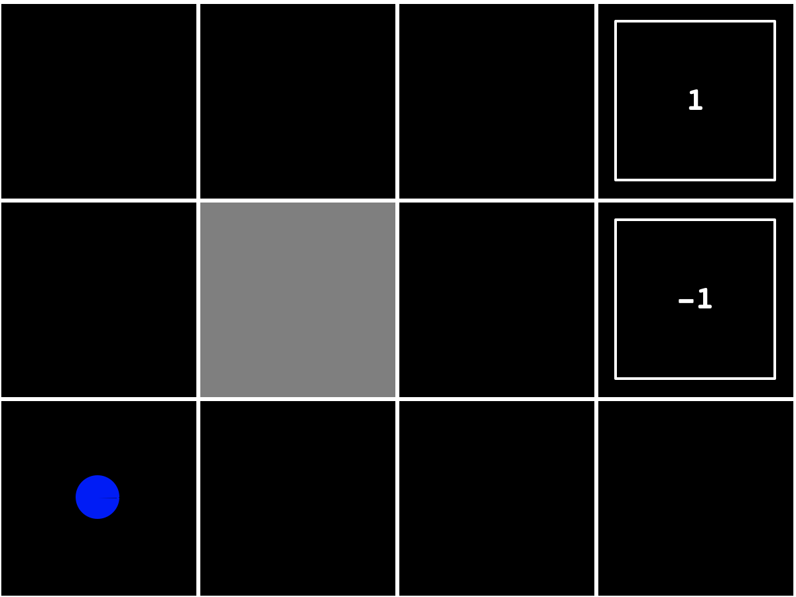
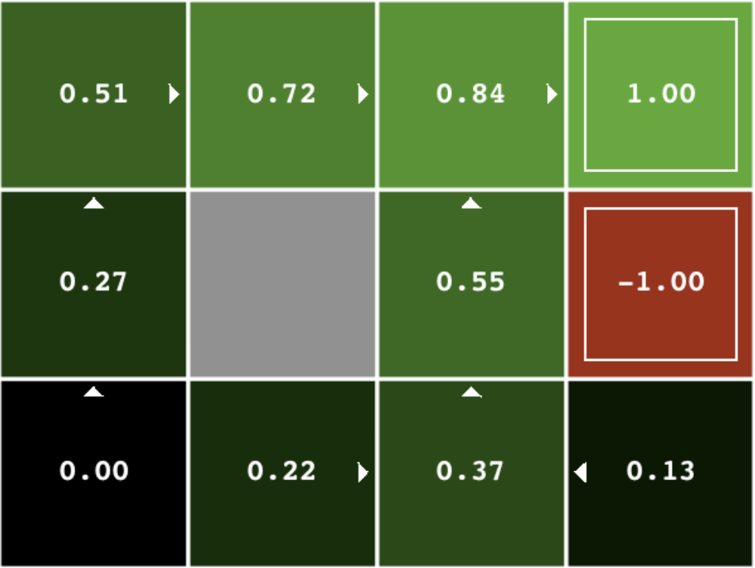

# 人工智能导论自选作业-迷宫寻路

### 规则描述

一个**迷宫**（示意如下）包含起点，终点，障碍等元素，游戏规则为：

* Agent从蓝点位置出发，找到一条到达终点（图中标注有数字的方块，可自行设置为其他值）的路径，途中不能穿越障碍（灰色格子）或跨越边界；
* Agent每走一步，便会损失固定的分数（可自行设置），到达任意一个终点则游戏结束，并取得方块内的分数。设整个过程步骤数为$T$, 每一步内损失或获取的分数计为$R_t$, 则最终得分数为：$G_T=\sum_{t=1}^T\gamma^{t-1} R_t$（折旧因子: $0<\gamma\le1$）；
* Agent的每一步可采取的动作包括向上，向下，向左，向右，但动作的结果具有随机性，例如，采取向上动作时，有80%概率向上运动一格，10%概率向左运动一格，10%概率向右运动一格，0%概率向下移动一格（若相应方向遇到边界或障碍则返回原处），其他动作结果以此类推。

### 作业要求

根据给定规则描述，使用强化学习方法设计一个能进行迷宫寻路的AI，使得程序经过多次迭代后找到从起点到终点的**最佳策略**，使得最终得分期望最高，具体要求如下：

* 程序能够处理一定规模的迷宫，至少包含起点，终点，墙体三种元素，也可自行设计其他元素并说明其作用；

* 使用至少两种强化学习方法（例如Value/Policy Iteration, Q-Learning, SARAR等）实现迷宫寻路AI，使程序经过多次迭代后能够找到从起点到终点得分最高的策略（即在每一步应该采取的最优动作），并且能够动态展示随着迭代的进行每个格子状态值的变化（示意如下）；

* 比较不同算法，不同规模迷宫，不同迷宫参数设计下的算法的运行效果，形成实验报告。

  

  

### 评分(100 Points)

代码部分（60 Points）

* 考察算法正确性，运行效率；
* 易用性，用户交互体验；
* 代码风格，注释完整性；
* 使用Python进行实现，并说明相关的依赖包。

文档 （40 Points，不超过4页）

* 说明地图设计，重要数据结构以及代码运行逻辑；

* 说明程序使用方法，交互界面元素说明；

* 简述算法原理以及实现方式；

* 实验结果展示与分析，要求实验结果可复现。

### 参考资料

* 教材：Artificial Intelligence - A Modern Approach 3rd, Chapter 17 & Chapter 21.
* PyQt可视化：https://pythonbasics.org/pyqt/