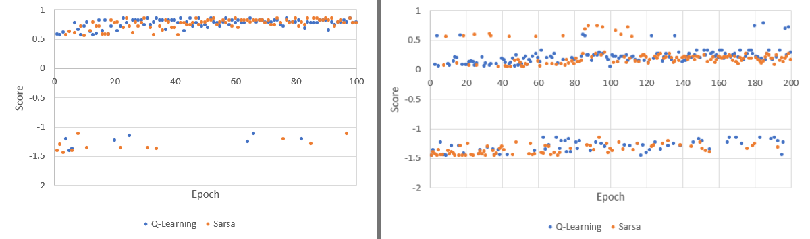

# 文档

## 算法原理

本程序实现了 Q-Learning 算法和 Sarsa 算法。两个算法均利用 $Q(s,a)$ 记录状态值，并在与环境的交互过程中不断更新，根据 $Q$ 值选取 $action$ 。

两个算法均需要根据 $Q$ 值随机选取 $action$ ，这里采用 $\epsilon-greedy$ 算法。即对于当前状态 $s$ ，以 $\gamma<1$ 的概率选取 $Q(s)$ 中值最大的 $action$，以 $1-\gamma$ 概率任意选取一个 $action$ 。

Q-Learning 算法对于当前状态 $s$ ，选择一个动作 $a$ 并执行，获得奖励 $r$ 和下一个状态 $s'$ ，据此更新 $Q$ ：
$$
Q(s,a)\leftarrow Q(s,a)+\alpha(r+\gamma \max_{a'}Q(s',a')-Q(s,a))
$$
之后更新状态 $s$ 为 $s'$ ，进行下一次更新。

Sarsa 算法需要一个初始动作 $a$ ，对于当前状态 $s$ ，执行动作 $a$ ，获得奖励 $r$ 和下一个状态 $s'$ ，这时要依据 $s'$ 预先选择下一次动作 $a'$ ，据此更新 $Q$ ：
$$
Q(s,a)\leftarrow Q(s,a)+\alpha(r+\gamma Q(s',a')-Q(s,a))
$$
之后更新状态 $s$ 为 $s'$ ，将 $a'$ 作为下一次动作 $a$ ，进行下一次更新。

## 代码结构

本程序自主实现了环境交互。除了以下描述的部分，代码中也有一定的注释说明。

### `envs.py`

类 `Env` 定义了地图的数据结构，即一个形状为 $m\times n$ 的矩形。还定义了：起始位置、终点位置、终点奖励、墙体位置、单步惩罚、刷新间隔。

文件中已经定义好了两个地图 `env1` 和 `env2 `。

### `model.py`

类 `Direct` 定义了可以行进的方向，也即可行的 `action` 。

类 `RLModel` 给出了训练模型的基本定义。

- `__init__` 函数中定义了模型所需的数据，这里将每个格子看作一个 `state` ；
- `chooseAction` 实现了 $\epsilon-greedy$ 随机选取算法，选择给定状态的下一个 `action` 。

类 `QLearningModel` 继承 `RLModel` 并实现了单次更新 $Q$ 的方法 `learn` ，每个 `epoch` 结束后在控制台打印所用步数和得分。类 `SarsaModel` 的代码同理，但 `QLearningModel` 使用的是 Q-Learning 算法，`SarsaModel` 使用的是 Sarsa 算法。其中 `current_score` 即为记录的分数，计算方法是 $G_T = \sum_{t=1}^{T}\gamma^{t-1}R_t$ 。

### `maze.py`

本文件完成了程序所需要的 GUI 。

类 `Grid` 继承 `QWidget` ，绘制迷宫中的一个方块，并保存了其相关状态（ $Q$ 值、是否为终点等）。

类 `Maze` 继承 `QMainWindow` ，绘制了整个迷宫，并保存其相关状态（Agent 当前位置等）。`initBox` 、`initUI` 函数分别负责构建状态数据和 UI 。`getValidDirect` 函数获得当前状态允许前进（即没有墙体阻拦）的方向。`randomDirect` 函数将给定的一个方向以 10% 的概率变为对应的左右方向。`moveTo` 方法执行前进操作，并更新 UI，注意这个函数会自动调用 `randomDirect` 。`isDone` 函数判断 Agent 是否到达终点。`reset` 函数将迷宫恢复到初始状态，用于开始新一轮训练。

其中重要的是 `train` 函数，其负责执行一次更新模型 $Q$ 的操作。本程序实现模型连续训练的方法是，利用 `QTimer` 定时器，重复执行 `train` 函数，`train` 函数的末尾会判断训练是否终止，若终止，则不再重启 `QTimer` ，否则重启 `QTimer` 进行下一轮训练。

### `main.py`

本文件是执行程序的入口，可以在这里修改使用的迷宫地图和训练模型。已经写好的模型是：`QLearningModel`、`SarsaModel`；已经写好的地图是：`env1`、`env2`。

## 代码运行与界面要素

使用 pip 安装 numpy 和 PyQt5 依赖库，在目录下运行以下命令：

```bash
python main.py
```

迷宫中 Agent 为蓝色圆点。除了墙体方块为灰色之外，每个方块显示其最大 $Q$ 值，并根据其最大 $Q$ 值的不同，显示不同深浅的颜色：绿色越深，代表该区域最大 $Q$ 值为正、且绝对值越高；红色越深，代表该区域最大 $Q$ 值为负、且绝对值越高。方块内部箭头指向使其 $Q$ 值最大的方向。内部有白色矩形的方块是终点，其数字代表其终点奖励。训练结束后，蓝色圆点回到起始点。

## 训练结果

训练的超参数设置：`epsilon` 为 0.9，`learning_rate` 为 0.1，`gamma` 为 0.9 。

迷宫 env1 ，单步惩罚为 0.05 ，100 epoch 的 Q-Learning 和 Sarsa 训练结果：


迷宫 env2 ，单步惩罚为 0.05 ，200 epoch 的 Q-Learning 和 Sarsa 训练结果：


`env1` 和 `env2` 的训练曲线如下：




迷宫 env1 ，单步惩罚为 0.1 ，100 epoch 的 Q-Learning 和 Sarsa 训练结果：


可见：Sarsa 模型比 Q-Learning 更谨慎、更难收敛，但更有可能尝试出较难发现的路径，Q-Learning 倾向于走已经发现的最好路径。
