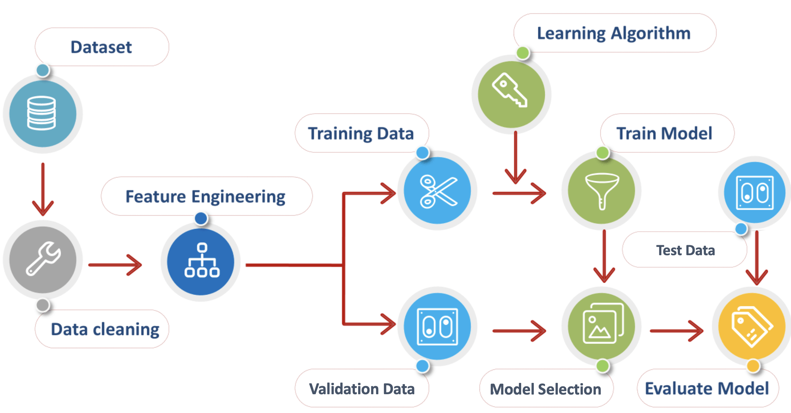

# 人工智能导论第二次作业-分类实践

### 介绍

大家在人智导课上已经接触了许多分类算法，如逻辑回归，决策树，支持向量机等。相信大家已经跃跃欲试，希望运用自己所学解决实际问题。本次作业旨在通过一个简单的二分类问题，让大家掌握一种机器学习库（推荐[scikit-learn](https://scikit-learn.org/stable/index.html)）的基本使用，了解数据挖掘的基本流程，并能够自己手动实现简单的机器学习算法。


### 数据集

本次作业中使用收入分类数据集，要求大家构建合适的分类模型，通过个人的年龄，教育水平，工作情况共十四条属性，对个人的收入进行分类。数据描述见[./data/summary.txt](./data/summary.txt)，训练数据见[./data/train.txt](./data/train.txt)，测试数据见[./data/test.txt](./data/test.txt)。


### 作业要求

一般的机器学习处理流程示意如下，借助此图，可将这次任务大致划分为四个模块。



#### 数据

这一步中需要读取数据，处理数据，将数据转化为合适的格式。例如，针对逻辑回归，要求输入为连续型变量，离散型/类别型属性如何转化；针对含有缺失值的数据，选择舍弃或是使用某些方法填充；哪些特征有助于训练，特征间组合是否有意义等，这些都可以让大家可以自由发挥。

##### 要求

* 进行适当的数据预处理：包括离散特征连续化，缺失值处理等；
* 进行简单的特征工程，例如特征选择，归一化等。

#### 模型

课上我们已经学习了诸多分类模型，不同模型基于的假设不同，适用的场景不同，在同一数据上的表现也不同，我们鼓励大家了解更多实际应用中常会出现的模型，尝试它们的效果，并能够模仿这些模型的接口，自己实现一些简单的模型。

##### 要求

* 可借助第三方算法包，自选三种**分类模型**分别完成该任务，简述三种分类模型的原理，对比其效果差异并分析；
* **Bonus**: 不借助机器学习算法包（但可以使用numpy，pandas等基础包），实现你所选择的三种模型中的一种，对比自己的实现和第三方实现的差异（实现效率，实际效果等）并简述原因。

#### 训练

模型训练时，为了进行模型/超参数选择以及避免模型过拟合，一种常见的方法如K折交叉验证：先将训练数据按一定比例划分为训练集和交叉验证集，每次迭代中只使用训练集对模型进行训练，在交叉验证集上测试模型的效果，如此随机划分几次并重复训练，最终选择在交叉验证集上平均效果最好的模型。

##### 要求

* 采用一些交叉验证和模型选择的技巧，避免模型过拟合，以及进行超参数调优。

#### 评估

模型评估在测试数据上进行。

##### 要求

* 不局限于模型的准确率，对模型选用多样的评价指标，推荐辅以可视化的手段（例如混淆矩阵）。

  


### 评分 (60 Points + 6 Points Bonus)

* 代码 (40 Points)

  * 建议按照作业要求的模块进行划分，注释与可读性在评分范围内；
* 文档 (20 Points)

  * 不超过三页，至少覆盖作业要求的必要说明；
* 加分项 (6 Points)
  * 自己实现的算法视工作量，难度以及文档说明，给予最高6分的额外分数；

如果大家在项目中遇到任何问题，欢迎在课程微信群中讨论 。


### 参考资料

#### 示例代码

为了帮助第一次接触数据挖掘的同学尽快掌握相关工具链以及问题解决流程，我们提供了一些简单的示例代码，见[./examples](./examples)文件夹。

```
# Current Folder: ./classification

cd ./examples
pip install -r requirements.txt -i https://pypi.tuna.tsinghua.edu.cn/simple
jupyter notebook
```

#### 官方教程

* numpy矩阵运算：https://www.numpy.org.cn/reference/
* pandas数据处理：https://pandas.pydata.org/docs/getting_started/intro_tutorials/
* scikit-learn库：https://scikit-learn.org/stable/index.html


