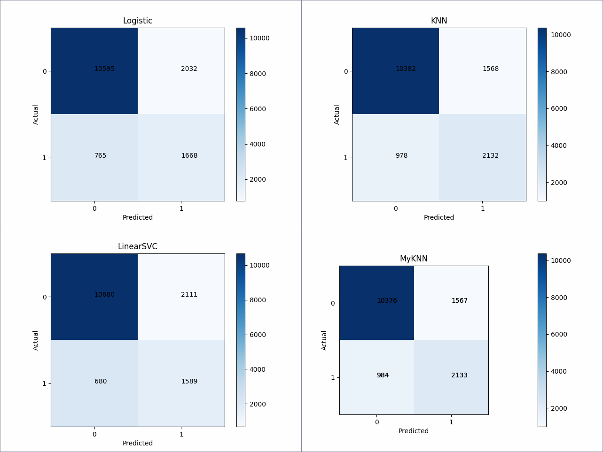

# 编程题说明文档

## 数据

利用 pandas 读取训练数据，由于训练集缺失值的数据只占 7%，为了避免引入错误数据，选择直接丢弃含有缺失值（即值为 ? ）的数据。

在编码之前，对数据分布进行总体分析，结果保存在 `classification/result` 文件夹内。

编码时，为了保证训练集和数据集编码方式统一，封装了 `Encoder` 类进行数据集编码。对于离散属性，考虑到种类比较多，利用 LabelEncoder 方法进行编码。然后对数据进行 Minmax 归一化处理，其中 fnlwgt、capital-gain、capital-loss 属性的分布极为不均，因此在归一化之前进行了对数缩放，即：$x\leftarrow \log_{10}(x+1)$ 。

## 模型

选择了sklearn 内置的 LogisticRegression、KNeighborsClassifier 和 LinearSVC 算法。

- LogisticRegression 利用 sigmoid 函数将线性回归的的预测结果映射到 $\{0,1\}$ ，利用交叉熵作为损失函数，利用 L-BFGS 算法进行求解。
- KNeighborsClassifier 统计距离预测数据最近的几个已知点，利用已知点的分类来给预测点的类别进行投票。
- LinearSVC 是线性分类支持向量机的实现，使用 Squared Hinge 作为损失函数。

此外，我手动实现了 KNN 算法模型（ `MyKNNClassifier.py` ），利用 KDTree 数据结构存储和查找训练样本。

## 训练

利用 10 折交叉验证进行超参数选择，评估方法为 sklearn 的 `cross_val_score` 方法：

- LogisticRegression 的超参数为 L2 正则项的系数 `C` 。经过交叉验证（见图 `classification/result/Logistic.png` ）选择最佳参数 $2.04$ 。
- KNeighborsClassifier 的超参数为最近点的数量 `n_neighbors` 。经过交叉验证（见图 `classification/result/KNN.png` ）选择最佳参数 $16$ 。
- LinearSVC 的超参数为惩罚项 `C` 。经过交叉验证（见图 `classification/result/LinearSVC.png` ）选择最佳参数 $16$ 。

## 评估

|        Model         |  Accuracy  |   Recall   | Precision  |  F1-score  | Cross Entropy | Train Time | Test Time |
| :------------------: | :--------: | :--------: | :--------: | :--------: | :-----------: | :--------: | :-------: |
|  LogisticRegression  |   0.8143   |   0.4508   |   0.6856   |   0.5439   |    6.4147     | **0.24s**  | **0.00s** |
| KNeighborsClassifier | **0.8309** |   0.5762   |   0.6855   | **0.6261** |  **5.8391**   |   0.27s    |   0.97s   |
|      LinearSVC       |   0.8147   |   0.4295   | **0.7003** |   0.5324   |    6.4009     |   1.29s    |   0.01s   |
|   MyKNNClassifier    |   0.8306   | **0.5765** |   0.6843   |   0.6258   |    5.8505     |   0.72s    | 2598.75s  |

混淆矩阵如下：

综合来看，KNN 算法的表现是最好的，但预测数据时远远不如其他两个模型。除此之外， LinearSVC 的准确率比较高，LogisticRegression 的效率是最高的。

我自己基于 KDTree 实现的 KNN 算法训练和预测效率远远落后于 sklearn 实现，其他指标与其大致相同，原因可能有：使用递归实现，层数较多时效率被拖慢；树的分层设置不够合理，将方差较大的特征优先分层，可能可以加快搜索速度。

